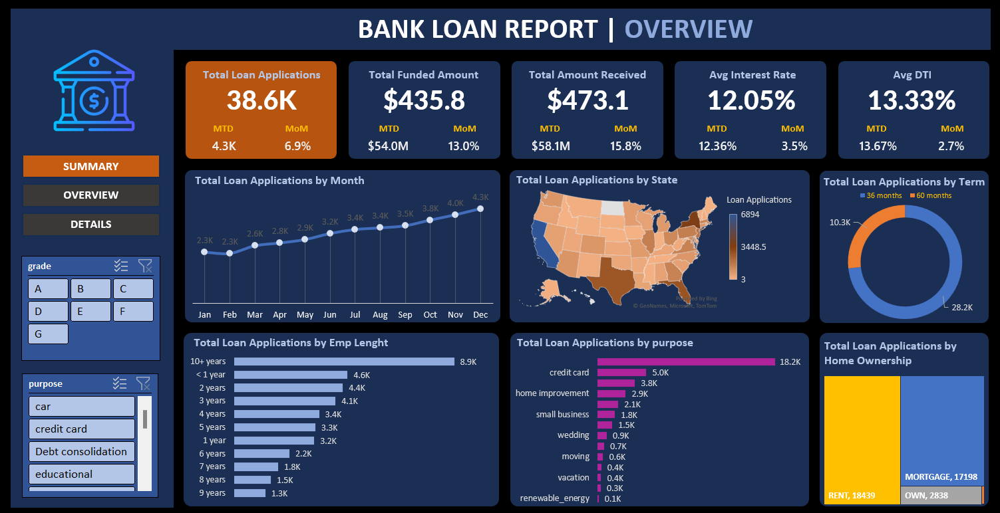
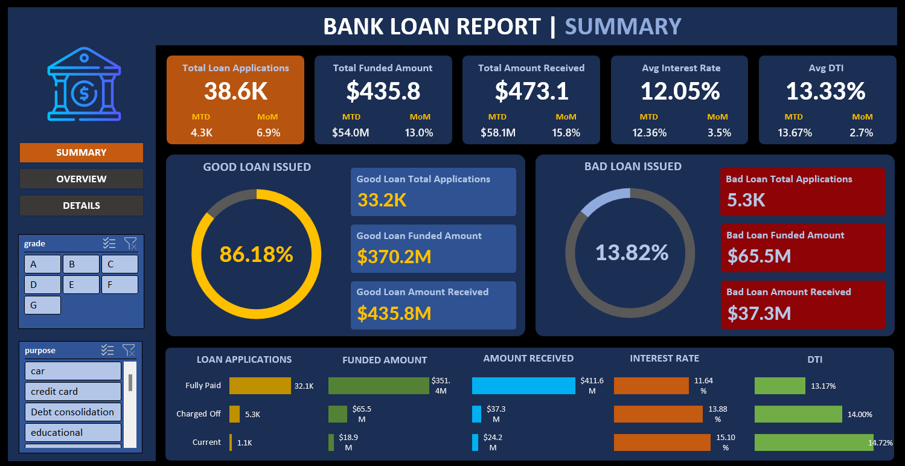

## Bank Loan Analysis
In this project I analysed a dataset of Bank loan transactions for the year 2021 and created a dashboard around it. 

### Introduction
The analysis was carried out in order to gain a comprehensive overview of our lending operations and monitor the performance of loans, I aim to create a grid view report categorized by 'Loan Status.’ By providing insights into metrics such as 'Total Loan Applications,' 'Total Funded Amount,' 'Total Amount Received,' 'Month-to-Date (MTD) Funded Amount,' 'MTD Amount Received,' 'Average Interest Rate,' and 'Average Debt-to-Income Ratio (DTI),' the view will empower us to make data-driven decisions and assess the health of the loan portfolio.

### Dashboard Screenshots
#### Overview

#### Summary

